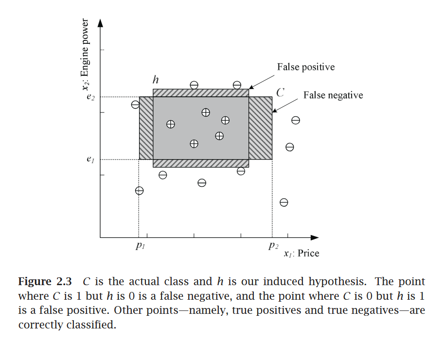

# CIT-423 Machine Learing

## Professor Md Abdul Masud

Reference Book: [Ethem Alpaydın - Introduction to Machine Learning (Third Edition)](pdf/Ethem%20Alpaydin%20-%20Introduction%20to%20Machine%20Learning-The%20MIT%20Press%20(2014).pdf)

### Introduction

- Concepts on Machine Learning, Deep Learning, and Reinforcement Learning
- Concepts on Supervised Learning, Unsupervised Learning, and Semi-Supervised Learning

- Supervised Learning
    - Discrete $\to$ Classification $\to$ Accuracy
    - Continuous $\to$ Regression $\to$ Error

- Prameter Estimation $\to$ Linear Regression

### Chapter 2 : Supervised Learning

#### 2.1 Learning a Class from Examples (Data)

**Classification:**
    
- Hypothesis $\to$ Equation/Mathematical Model

\[ Error, E(h|x) = \sum_{t=1}^{N} (h(t) \neq r^t) \]

- Most specific hypothesis $\to$ tightest hypothesis + all positive
- Most general hypothesis $\to$ largest hypothesis

**Figure 2.3**[^1]

 

!!! note "Assignment"

    **Multi-Class Classification**

    - Confusion Matrix
    - Accuracy
    - Precision
    - Recall
    - F1-Score
    - ROC Curve

#### 2.2 Vapnik-Chervonenkis (VC) Dimention

- largest point
- n points $\to$ $2^n$ possible points
- $\tau = {f(x)}$

#### 2.3 Probably Approximately Correct (PAC) Learning

Given a class, $C$, and examples drawn from some unknown but fixed probability distribution, $p(x)$, we want to find the number of examples, $N$, such that with probability at least $1 − δ$, the hypothesis $h$ has error at most $\epsilon$, for arbitrary $δ ≤ 1/2$ and $\epsilon > 0$  

$$
P \{CΔh ≤ \epsilon \} ≥ 1 − δ
$$

where $CΔh$ is the region of difference between $C$ and $h$

#### 2.4 Noise

Next: Learning Multiple Class

<!-- Footnotes -->

[^1]: Figure 2.3 is from the book: Ethem Alpaydın - Introduction to Machine Learning (Third Edition)