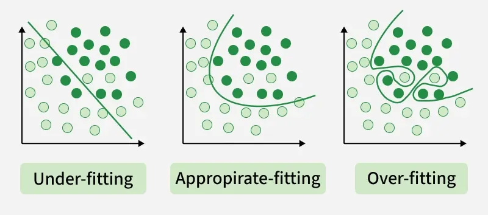

# CIT-423 Machine Learing

## Professor Md Abdul Masud

Reference Book: [Ethem Alpaydın - Introduction to Machine Learning (Third Edition)](pdf/Ethem%20Alpaydin%20-%20Introduction%20to%20Machine%20Learning-The%20MIT%20Press%20(2014).pdf)

### Introduction

- Concepts on Machine Learning, Deep Learning, and Reinforcement Learning
- Concepts on Supervised Learning, Unsupervised Learning, and Semi-Supervised Learning

- Supervised Learning
    - Discrete $\to$ Classification $\to$ Accuracy
    - Continuous $\to$ Regression $\to$ Error

- Prameter Estimation $\to$ Linear Regression

### Chapter 2 : Supervised Learning

#### 2.1 Learning a Class from Examples (Data)

**Classification:**
    
- Hypothesis $\to$ Equation/Mathematical Model

\[ Error, E(h|x) = \sum_{t=1}^{N} (h(t) \neq r^t) \]

- Most specific hypothesis $\to$ tightest hypothesis + all positive
- Most general hypothesis $\to$ largest hypothesis

!!! note "Assignment"

    **Multi-Class Classification**

    - Confusion Matrix
    - Accuracy
    - Precision
    - Recall
    - F1-Score
    - ROC Curve

#### 2.2 Vapnik-Chervonenkis (VC) Dimention

- largest point
- n points $\to$ $2^n$ possible points
- $\tau = {f(x)}$

#### 2.3 Probably Approximately Correct (PAC) Learning

Given a class, $C$, and examples drawn from some unknown but fixed probability distribution, $p(x)$, we want to find the number of examples, $N$, such that with probability at least $1 − δ$, the hypothesis $h$ has error at most $\epsilon$, for arbitrary $δ ≤ 1/2$ and $\epsilon > 0$  

$$
P \{CΔh ≤ \epsilon \} ≥ 1 − δ
$$

where $CΔh$ is the region of difference between $C$ and $h$

#### 2.4 Noise

#### 2.5 Learning Multiple Classes

In the general case, we have $K$ classes denoted as $C_i, i = 1, . . . , K$, and an input instance belongs to one and exactly one of them. The training set is now of the form  $X = \{x^t , r^t \}N  t =1$ where $r$ has $K$ dimensions and  

\[r^{t}_{i}=  
    \begin{cases}
        1, & {\text{if } x^t ∈ C_i}.\\
        0, & {\text{if } x^t ∈ C_j , j \neq i}.
    \end{cases}
\]

We have $K$ hypotheses to learn such that,

\[h_i (x^t)=  
    \begin{cases}
        1, & {\text{if } x^t ∈ C_i}.\\
        0, & {\text{if } x^t ∈ C_j , j \neq i}.
    \end{cases}
\]

The total empirical error takes a sum over the predictions for all classes over all instances:

\[
    E (\{h_i \}_{i=1}^{K} | X) =  \sum_{t=1}^{N}  \sum_{i=1}^{K}  1 (h_i(x^t) \neq r_{i}^{t} )
\]

#### 2.6 Regression

- The function is not known but we have a training set of examples drawn from it, where $r^t ∈ \mathbb{R}$. If there is no noise, the task is interpolation.

\[X = \{x^t, r^t \}^{N}_{t=1}\]

- We would like to find the function $f(x)$ that passes through these points such that we have  $r^t = f(x^t)$

- In polynomial interpolation, given $N$ points, we find the $(N−1)$st degree polynomial that we can use to predict the output for any $x$. This is called extrapolation extrapolation if $x$ is outside of the range of $x^t$ in the training set.

- In regression, there is noise added to the output of the unknown function where $f(x) ∈ \mathbb{R}$ is the unknown function and is random noise.

\[r^t = f(x^t) + \epsilon\]

- The explanation for noise is that there are extra hidden variables that we cannot observe where $z^t$ denote those hidden variables.

\[r^t = f∗(x^t, z^t)\]

- The empirical error on the training set $X$ is  

\[E(g|X) = \frac{1}{N} \sum_{t=1}^{N} [r^t − g(x^t)]^2\]

- Our aim is to find $g(·)$ that minimizes the empirical error.

\[g(x) = w_1 x_1 + · · · + w_d x_d + w_0 =  \sum_{j=1}^{d}  w_j x_j + w_0\]

- There we used a single input linear model where $w_1$ and $w_0$ are the parameters to learn from data.

\[g(x) = w_1 x + w_0\]

- The $w_1$ and $w_0$ values should minimize where $\bar{x} = \sum_{t} x^t /N$ and $\bar{r} = \sum_{t} r^t/N$

\[E(w_1, w_0 |X) = \frac{1}{N} \sum_{t=1}{N} [r^t − (w_1 x^t + w_0)]^2\]

\[w_1 = \frac{ \sum_{t} x^t r^t − \overline{xr} N} { \sum_{t} (x^t)^2 − N\bar{x}^2}\]

\[w_0 = \bar{r} − w_1x\]

!!! note "Assignment"
    Errors and Evaluation Metrics for Regression

#### 2.7 Model Selection and Generalization

#### 2.8 Dimensions of a Supervised Machine Learning Algorithm

- Loss function, $L(·)$, to compute the difference between the desired output, $r^t$, and our approximation to it, $g(x^t |θ)$, given the current value of the parameters, $θ$. The approximation error, or loss, is the sum of losses over the individual instances

\[E(θ|X) = \sum_{t} L (r^t, g(x^t |θ))$\]

- Optimization procedure to find θ∗ that minimizes the total error

\[θ^∗ = \text{arg }^{\text{min}}_{θ} ~E(θ|X)\]